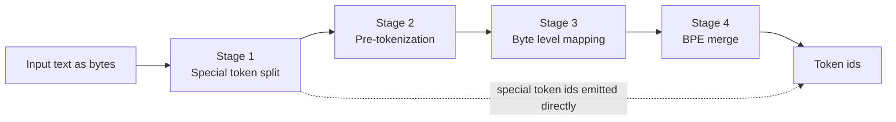
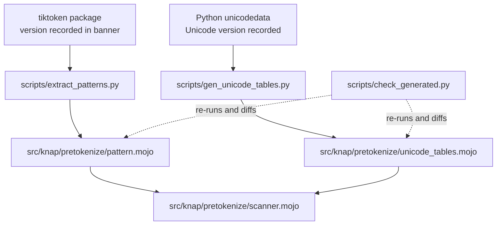

<!--
  SPDX-License-Identifier: EUPL-1.2
  Copyright 2026 Olaf Yunus Laitinen Imanov
  Part of the Knap project. See LICENSE for terms.
-->

# Knap Architecture

| Field | Value |
| --- | --- |
| Document | `docs/ARCHITECTURE.md` |
| Project | Knap, a pure Mojo byte level BPE tokenizer |
| Version | 1.0.0 |
| Status | Draft |
| Applies to | Knap 0.1.0, Mojo 1.0.0 |
| Author | Olaf Yunus Laitinen Imanov |
| ORCID | [0009-0006-5184-0810](https://orcid.org/0009-0006-5184-0810) |
| Affiliation | School of Information and Communication Technology, Metropolia University of Applied Sciences |
| Created | 2026-09-07 |
| Updated | 2026-09-07 |
| Licence | EUPL-1.2 |

---

## Contents

1. [Purpose](#purpose)
2. [Encoding pipeline](#encoding-pipeline)
3. [The merge rule](#the-merge-rule)
4. [Cost model](#cost-model)
5. [Core data structures](#core-data-structures)
6. [Alternation ordering](#alternation-ordering)
7. [Why single documents are not parallelized](#why-single-documents-are-not-parallelized)
8. [Generated files](#generated-files)
9. [Toolchain ground truth](#toolchain-ground-truth)
10. [Unstable API inventory](#unstable-api-inventory)
11. [Dependency decisions](#dependency-decisions)
12. [Open questions](#open-questions)

---

## Purpose

Knap has three goals, in priority order. Exact parity with `tiktoken` on
arbitrary input comes first, because correctness is the product. A SIMD
pre-tokenizer usable as a standalone module comes second, because the regex
pre-tokenization stage is where real CPU time goes and where vectorization
genuinely pays. A Python free path for Mojo and MAX applications comes third.

Raw merge speed is explicitly not a goal. The BPE merge loop is hash lookups,
data dependent branching, and a priority selection. It does not vectorize.
Prior art in pure Mojo is already slower than `rs-bpe` in Rust, and beating
the best Rust implementation on merge speed is unlikely. Where a design choice
trades correctness for speed, correctness wins.

## Encoding pipeline

Encoding proceeds in four stages, kept separable so each can be tested and
benchmarked independently.

| Stage | Input | Output | Notes |
| --- | --- | --- | --- |
| 1, special token split | Byte sequence | Segments plus directly emitted ids | A disallowed special token in the input returns an error rather than encoding. |
| 2, pre-tokenization | One segment | Pieces, as byte ranges | The performance hot spot, and the only stage worth vectorizing. |
| 3, byte level mapping | One piece | Raw UTF-8 bytes | There is no character level abstraction anywhere in Knap. |
| 4, BPE merge | One piece's bytes | Token ids | Each piece is merged independently of every other. |

### A worked example

The example below was produced by running the reference implementation,
`tiktoken` 0.14.0 with `cl100k_base`, rather than written from memory. The
input is `Knap tokenizes 1234 bytes.`, which is 26 bytes.

Stage 2 splits it into seven pieces, and stage 4 merges each independently:

| Piece | Text | Bytes | Token ids |
| --- | --- | --- | --- |
| 0 | `Knap` | 75, 110, 97, 112 | 42, 7004 |
| 1 | ` tokenizes` | 32, 116, 111, ... | 4037, 4861 |
| 2 | ` ` | 32 | 220 |
| 3 | `123` | 49, 50, 51 | 4513 |
| 4 | `4` | 52 | 19 |
| 5 | ` bytes` | 32, 98, 121, ... | 5943 |
| 6 | `.` | 46 | 13 |

The full result is `[42, 7004, 4037, 4861, 220, 4513, 19, 5943, 13]`, and it
round trips back to the input exactly.

Pieces 3 and 4 are the interesting ones. The number 1234 does not become a
single piece: `cl100k_base` groups digits into runs of at most three, so 1234
splits as `123` then `4`. This is a real divergence source, and it is
measured rather than assumed. Reference behaviour across digit lengths:

| Digits | Pieces |
| --- | --- |
| 1 | `1` |
| 3 | `111` |
| 4 | `111`, `1` |
| 5 | `111`, `11` |
| 8 | `111`, `111`, `11` |

## The merge rule

Byte level BPE repeatedly merges the adjacent pair with the lowest merge rank
until no adjacent pair is ranked.

Let a piece be the sequence $s = (s_1, \dots, s_n)$, where each $s_i$ is a
byte string, and let $r$ be the rank function that maps a byte string to its
merge rank, undefined where no merge exists. Write $\Vert$ for
concatenation. Each round selects

$$i^{*} = \arg\min_{1 \le i < |s|} r(s_i \Vert s_{i+1})$$

and replaces the pair at $i^{*}$ with its concatenation. The loop terminates
when no adjacent pair is ranked, at which point each remaining element maps
to exactly one token id.

Ties cannot occur, because ranks are unique per merge in both target
vocabularies. Where a pair is unranked it is simply not a candidate, which is
what makes termination guaranteed: every round strictly reduces $|s|$ by one.

## Cost model

### Merge loop

The naive merge loop rescans the piece for the minimum rank on each round.
With $n$ the piece length in bytes, that is $O(n)$ work per round across
$O(n)$ rounds, so

$$T_{\text{merge}}(n) = O(n^{2})$$

This is acceptable in practice because $n$ stays small. Pre-tokenization
bounds piece length well below the point where the quadratic term matters:
pieces are single words, short whitespace runs, or digit runs of at most
three, as the worked example above shows. Optimising this loop before
measuring would be optimising the wrong thing.

### SIMD classifier

For an input of $n$ bytes and a vector width of $W$ lanes, the classifier
performs

$$\left\lceil \frac{n}{W} \right\rceil$$

vector iterations, followed by a scalar tail of $n \bmod W$ bytes. $W$ is
taken from the target at compile time and is never hardcoded. On the
development machine described under
[Toolchain ground truth](#toolchain-ground-truth), $W = 32$ for byte lanes.

### Piece cache

Natural text is approximately Zipf distributed, so a cache from piece bytes to
token id sequence should pay well. Under a Zipf model with exponent $\alpha$
over a vocabulary of $N$ distinct pieces, the probability of the piece of rank
$k$ is

$$P(k) = \frac{k^{-\alpha}}{\sum_{i=1}^{N} i^{-\alpha}}$$

so a cache holding the top $m$ pieces has an expected hit rate of
$\sum_{k=1}^{m} P(k)$.

This is a model, not a measurement. The measured hit rate on the real corpus
is what governs whether the cache ships, and the memory cost is documented
alongside it. The cache is off by default until that measurement exists, and
it is toggled at compile time through `-D` and `std.defines` rather than by a
runtime branch in the hot loop.

## Core data structures

| Structure | Layout | Rationale |
| --- | --- | --- |
| `FlatVocab` | One contiguous byte buffer holding every token string, plus parallel `offsets` and `lengths` arrays indexed by token id. | Decoding becomes a memcpy from `data + offsets[id]`. This is standard practice, not an innovation, and it is why decode is fast in every implementation. |
| Rank table | Hash map keyed on piece bytes, as `tiktoken` does, built on `hashlib`. | Start straightforward. Optimise only with benchmark evidence, and benchmark the default hasher before writing a custom one. |
| Piece cache | Map from piece bytes to token id sequence. Optional, off by default. | See the Zipf model above. Ships only if measurement justifies the memory. |

Decode throughput is deliberately not a headline metric anywhere in this
project. It is a series of memcpy calls and it is already trivially fast in
every implementation, so reporting it prominently would mislead.

## Alternation ordering

The pre-tokenization pattern is an ordered alternation. It is tried left to
right and the first alternative that matches wins. Reordering the
alternatives for convenience changes the pieces produced on some inputs, and
therefore changes the tokens.

The scanner must encode that ordering explicitly rather than relying on a
state machine that happens to reproduce it. Knap is not writing a regex
engine: it is a hand rolled scanner that reproduces the behaviour of two
specific patterns, which is a far smaller problem and the only tractable path
to SIMD.

The pattern itself is never transcribed by hand. Both patterns are long, and
`o200k_base` especially so, and a single character error produces silent
divergence on rare inputs. See [Generated files](#generated-files).

## Why single documents are not parallelized

Knap does not parallelize pre-tokenization within a single document, and this
constraint is deliberate rather than unfinished work.

Chunking a byte stream and pre-tokenizing the chunks independently can change
the result, because a pattern match may span a chunk boundary. Splitting mid
match produces different pieces and therefore different tokens. `tiktoken`
handles this with boundary adjustment logic, and reproducing that correctly
is a project of its own.

Batches are parallelized across documents instead. That is where the
throughput is anyway, and it is trivially correct.

This paragraph exists so the constraint is not optimised away later by
someone who does not know why it is here.

## Generated files

Two files are generated and committed. Both carry a banner naming the
generator, the upstream source and its version, and the generation date, plus
a statement that manual edits will be overwritten.

`scripts/check_generated.py` runs in CI and fails if a committed generated
file no longer matches what its generator produces, so pattern drift is
caught rather than discovered through a divergence months later.

## Toolchain ground truth

Everything in this section was verified by compiling against the pinned
compiler on 2026-09-07, not recalled. Section 11 of the project brief
requires corrections to be recorded here so they are not relearned.

Environment as measured:

| Property | Value |
| --- | --- |
| Mojo | 1.0.0, build `ed45d567` |
| Target triple | `x86_64-unknown-linux-gnu` |
| Target CPU | `znver1`, with AVX2 and without AVX-512 |
| Byte lane width | 32, read from `simd_width_of` rather than hardcoded |
| Host | Ubuntu 24.04.4 under WSL 2, 8 cores |
| uv environment | Python 3.12.3, tiktoken 0.14.0, tokenizers 0.23.2, regex 2026.9.3 |
| pixi environment | Python 3.14.7, Mojo from the stable `max` channel |

Corrections to widely held assumptions, each verified by compiling:

| Assumption | Reality in Mojo 1.0.0 |
| --- | --- |
| `fn` declares a function | Removed. `def` is the only function keyword, and `fn` is a hard parse error. |
| `alias X = ...` is obsolete | Still valid in 1.0.0. `comptime X = ...` also works and is preferred as forward compatible. |
| `@value` generates a constructor | Removed. Use `@fieldwise_init` with explicit trait conformance. |
| Standard library imports are bare | They are not. `from std.sys import ...` resolves; `from sys import ...` does not. |
| `mojo test` runs test files | The subcommand does not exist. A test file is a program whose `main` drives `TestSuite.discover_tests`. |
| SIMD `a > b` yields a lane mask | It yields a single `Bool` for the whole vector. The per lane mask comes from `a.gt(b)`, and likewise `a.eq(b)`. |
| `--Werror` and `--warn-on-unstable-apis` compose | They do not. Together the build fails, because essentially the whole standard library is unstable. CI runs them as separate jobs. |
| `mojo format` has a check mode | It does not. It rewrites in place, so CI runs it and then checks that the working tree is unchanged. |

The SIMD comparison correction is the most dangerous of these, because the
wrong form still compiles in some expressions and silently computes something
else. `tests/test_toolchain.mojo` pins the correct spelling with an executable
assertion so a future toolchain change surfaces as a test failure.

## Unstable API inventory

Mojo standard library APIs are unstable unless explicitly marked stable, and
the stable set is currently small. Eliminating unstable API use is not
achievable today. The goal is visible exposure.

Regenerate this table with `python scripts/unstable_api_inventory.py`. The
figure grows with the code: at M0 a single four-test file produced 108 uses
across 22 APIs, and at M1 the five test files and the library they exercise
produce **2484 uses across 50 distinct APIs**.

The top of that inventory, as measured on 2026-09-07:

| Unstable API | Uses | What breaks if it changes |
| --- | --- | --- |
| `__init__` | 1292 | Construction of every value type. Effectively the whole project. |
| `Int` | 126 | Everything. Token ids, offsets, lengths, every loop counter. |
| `len` | 114 | Every collection traversal. |
| `__iter__`, `__next__` | 168 | Every for loop over a list or a range. |
| `__make_tstring` | 103 | Template strings, so every diagnostic message. |
| `__mlir_bool__` | 88 | Every conditional. |
| `assert_equal`, `assert_true` | 94 | The test suite only. Mechanical to update. |
| `Error` | 56 | The error path, which is how Knap reports malformed input instead of panicking. |
| `range` | 56 | Every loop. |
| `UInt8` | 48 | Byte typing, the substrate of a byte level tokenizer. |
| `__iadd__`, `__add__`, `__lt__` | 106 | Arithmetic and comparison in offset and rank handling. |
| `append` | 42 | Buffer construction in FlatVocab and the loader. |
| Remaining 37 APIs | 291 | SIMD, string, base64, and file access helpers. |

The shape of this table is the finding, not any individual row. When `Int`,
`len`, `range`, and the conditional operator are all unstable, an unstable
API inventory cannot function as an action list. It is a record of what a
toolchain upgrade might cost, and the proportionate response is to pin the
compiler exactly, which this project does.

## Dependency decisions

Every third party dependency must be justified in one sentence, pinned, and
compatible with Mojo 1.0.0. A dependency pinned to a pre-1.0 compiler is an
automatic no.

| Package | Decision | Reason |
| --- | --- | --- |
| `EmberJson` | Accepted, adopted when its consumer is built | Evaluated at M1 against both acceptance criteria and it passed. A 12.2 MB document holding 600 thousand entries parsed in 521 ms, and escaped codepoints, surrogate pair emoji, CJK, escaped control characters, and escaped quotation marks all resolved to the correct keys. Version 0.3.4, Apache-2.0, pinned to `mojo-compiler >=1.0.0,<2.0a0`. It is deliberately not in `pixi.toml` yet: nothing imports it until the Hugging Face loader exists, and an unused dependency is still a dependency. |
| `extramojo` | Not adopted | Version 0.23.0 is available and pinned to `mojo-compiler 1.0.0.*`, so it is eligible. It is not needed: the standard library reads a 3.6 MB vocabulary and builds a FlatVocab in 88 ms, which is not a bottleneck worth a dependency. Revisit only if corpus loading shows up in a benchmark. |
| `mojo-regex` | Rejected | Pinned to compiler 0.26.2, which predates 1.0, so it is an automatic no. It is also the wrong tool, since Knap writes a specialised scanner rather than using a regex engine. Reading its source for reference remains fine. |
| `mtest` | Rejected for now | Pinned to a 1.0.0 beta compiler. The standard library `TestSuite` is the safer default and has proven adequate. |
| `mojo-libc` | Rejected | No genuine libc need has appeared, and none is expected. |

No third party Mojo dependency is in use as of M1. The only runtime
dependency is the pinned compiler itself.

## Open questions

| Question | Status | Resolve by |
| --- | --- | --- |
| Can Mojo 1.0.0 build an importable Python extension module? | Not yet investigated. The fallback is `mojo build --emit shared-lib` loaded through `ctypes`, and the public API is being designed with a flat C compatible surface so that path stays open. | M6 Track B. Record the finding here as a fact with a date, not as an assumption. |
| Scanner state machine table and diagram | Not yet designed. It depends on the extracted pattern, which arrives with `scripts/extract_patterns.py`. Designing it before the pattern exists would be guesswork. | M2. |
| Two stage table against sorted range binary search for Unicode property lookup | Not yet benchmarked. Both will be measured before one is committed to. | M2, written up in `docs/UNICODE.md`. |
| Piece cache hit rate on real text | Modelled above, not measured. | M5. |

---

## Document control

| Field | Value |
| --- | --- |
| Previous | [README.md](../README.md) |
| Next | [docs/CORRECTNESS.md](CORRECTNESS.md) |
| Index | [README.md](../README.md) |
| Revision | 1.0.0 |
| Last reviewed | 2026-09-07 |

Knap is licensed under the European Union Public Licence 1.2.
Copyright 2026 Olaf Yunus Laitinen Imanov, Metropolia University of Applied
Sciences. See [LICENSE](../LICENSE) for the full terms.

<!-- End of document: docs/ARCHITECTURE.md -->
