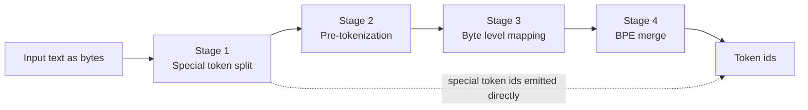
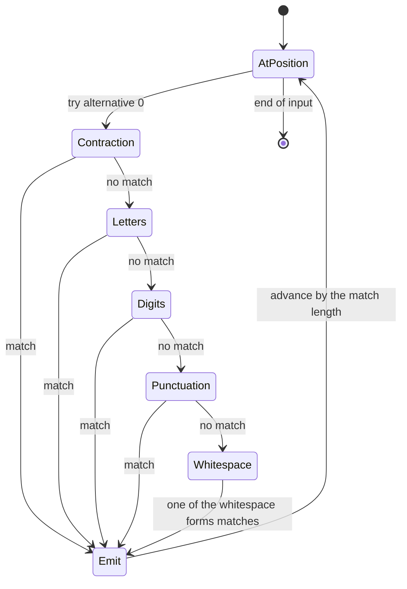
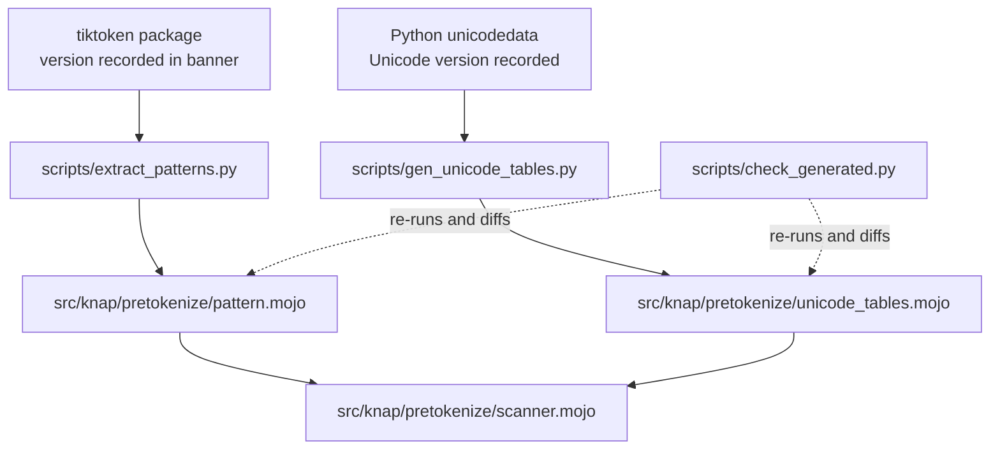

<!--
  SPDX-License-Identifier: EUPL-1.2
  Copyright 2026 Olaf Yunus Laitinen Imanov
  Part of the Knap project. See LICENSE for terms.
-->

# Knap Architecture

<p align="center">
  <picture>
    <source media="(prefers-color-scheme: dark)"
            srcset="assets/knap_logo_transparent_white.svg">
    
  </picture>
</p>

| Field | Value |
| --- | --- |
| Document | `docs/ARCHITECTURE.md` |
| Project | Knap, a pure Mojo byte level BPE tokenizer |
| Version | 1.0.0 |
| Status | Draft |
| Applies to | Knap 1.0.0, Mojo 1.0.0 |
| Author | Olaf Yunus Laitinen Imanov |
| ORCID | [0009-0006-5184-0810](https://orcid.org/0009-0006-5184-0810) |
| Affiliation | School of Information and Communication Technology, Metropolia University of Applied Sciences |
| Created | 2026-09-07 |
| Updated | 2026-09-07 |
| Licence | EUPL-1.2 |
| Website | <https://knap.lovable.app> |

---

## Contents

1. [Purpose](#purpose)
2. [Encoding pipeline](#encoding-pipeline)
3. [The merge rule](#the-merge-rule)
4. [Where the time actually went](#where-the-time-actually-went)
5. [Cost model](#cost-model)
6. [Core data structures](#core-data-structures)
7. [The scanner](#the-scanner)
8. [Alternation ordering](#alternation-ordering)
9. [Why single documents are not parallelized](#why-single-documents-are-not-parallelized)
10. [Generated files](#generated-files)
11. [Toolchain ground truth](#toolchain-ground-truth)
12. [Unstable API inventory](#unstable-api-inventory)
13. [Dependency decisions](#dependency-decisions)
14. [Open questions](#open-questions)

---

## Purpose

Knap has three goals, in priority order. Being exactly right on arbitrary
input comes first, because correctness is the product, and the way that is
established is differential testing against `tiktoken` as the reference
implementation. A SIMD pre-tokenizer usable as a standalone module comes
second, because the regex pre-tokenization stage is where real CPU time goes
and where vectorization genuinely pays. A Python free path for Mojo and MAX
applications comes third.

Nothing in this library is a port. The pre-tokenizer is a hand written
scanner, the Unicode tables are generated from the Character Database, and
the merge loop, the rank table and the memory layout are all this project's
own. No source code has been taken from any of the implementations it is
measured against, and the one artefact taken programmatically is the
pre-tokenization pattern, extracted as a specification with its provenance
recorded. See [THIRD_PARTY_NOTICES.md](../THIRD_PARTY_NOTICES.md).

Raw merge speed is explicitly not a goal. The BPE merge loop is hash lookups,
data dependent branching, and a priority selection. It does not vectorize.
Beating the best Rust implementation on merge speed is unlikely, and where a
design choice trades correctness for speed, correctness wins.

That paragraph was written before anything was measured and it is left as it
was, because it turned out to be half right and the half it got wrong is
instructive. Knap is now faster than `tiktoken` on three of the four
distinct encode behaviours, and it got there by removing lookups rather than
by making the loop clever. It is still slower than `rs-bpe`. The prediction
that raw merge speed was unreachable was too pessimistic; the prediction
that it would not come from vectorising the loop was right.

## Encoding pipeline

Encoding proceeds in four stages, kept separable so each can be tested and
benchmarked independently.



| Stage | Input | Output | Notes |
| --- | --- | --- | --- |
| 1, special token split | Byte sequence | Segments plus directly emitted ids | A disallowed special token in the input returns an error rather than encoding. |
| 2, pre-tokenization | One segment | Pieces, as byte ranges | The performance hot spot, and the only stage worth vectorizing. |
| 3, byte level mapping | One piece | Raw UTF-8 bytes | There is no character level abstraction anywhere in Knap. |
| 4, BPE merge | One piece's bytes | Token ids | Each piece is merged independently of every other. |

### A worked example

The example below was produced by running the reference implementation,
`tiktoken` 0.14.0 with `cl100k_base`, rather than written from memory. The
input is `Knap tokenizes 1234 bytes.`, which is 26 bytes.

Stage 2 splits it into seven pieces, and stage 4 merges each independently:

| Piece | Text | Bytes | Token ids |
| --- | --- | --- | --- |
| 0 | `Knap` | 75, 110, 97, 112 | 42, 7004 |
| 1 | ` tokenizes` | 32, 116, 111, ... | 4037, 4861 |
| 2 | ` ` | 32 | 220 |
| 3 | `123` | 49, 50, 51 | 4513 |
| 4 | `4` | 52 | 19 |
| 5 | ` bytes` | 32, 98, 121, ... | 5943 |
| 6 | `.` | 46 | 13 |

The full result is `[42, 7004, 4037, 4861, 220, 4513, 19, 5943, 13]`, and it
round trips back to the input exactly.

Pieces 3 and 4 are the interesting ones. The number 1234 does not become a
single piece: `cl100k_base` groups digits into runs of at most three, so 1234
splits as `123` then `4`. This is a real divergence source, and it is
measured rather than assumed. Reference behaviour across digit lengths:

| Digits | Pieces |
| --- | --- |
| 1 | `1` |
| 3 | `111` |
| 4 | `111`, `1` |
| 5 | `111`, `11` |
| 8 | `111`, `111`, `11` |

That cap is not universal. `cl100k_base` and `o200k_base` both stop a digit
run at three; the `gpt2` pattern does not stop it at all, so `1234567890` is
a single piece under the four encodings that use it. Anything reasoning
about digit runs has to know which of the three patterns it is looking at.

## The merge rule

Byte level BPE repeatedly merges the adjacent pair with the lowest merge rank
until no adjacent pair is ranked.

Let a piece be the sequence $s = (s_1, \dots, s_n)$, where each $s_i$ is a
byte string, and let $r$ be the rank function that maps a byte string to its
merge rank, undefined where no merge exists. Write $\Vert$ for
concatenation. Each round selects

$$i^{*} = \arg\min_{1 \le i < |s|} r(s_i \Vert s_{i+1})$$

and replaces the pair at $i^{*}$ with its concatenation. The loop terminates
when no adjacent pair is ranked, at which point each remaining element maps
to exactly one token id.

Ties cannot occur, because ranks are unique per merge in all seven shipped
vocabularies. Where a pair is unranked it is simply not a candidate, which is
what makes termination guaranteed: every round strictly reduces $|s|$ by one.

## Where the time actually went

The cost model below was written before anything was measured, and it was
right about the shape of the pipeline and wrong about what dominates it. The
correction is kept here rather than folded away, because the way it was found
is reusable and the way it was missed is common.

The rank table was a `Dict[String, Int]`. A `String` key owns its bytes, so
every lookup copied the byte range being asked about into a fresh allocation
before anything was compared. The merge loop is quadratic in the piece
length, so a five byte piece paid ten allocations to ask ten questions about
bytes the caller already held in a buffer.

Replacing it with `ByteMap`, a map keyed on a borrowed span with its keys in
a flat arena, nearly doubled encode throughput and halved the 110 MB parity
gate, with byte identical output.

| Measure | Before | After |
| --- | --- | --- |
| Encode, `cl100k_base` | 1.79 MB/s | 3.44 MB/s |
| Encode, `o200k_base` | 1.90 MB/s | 3.21 MB/s |
| 110 MB encode parity gate | 208.5 s | 105.8 s |

Those four throughput figures are the state on 2026-09-08 and are kept as
the record of that change. The current numbers are higher again, because the
merge path was rewritten the next day. See
[How the merge loop got faster](BENCHMARKS.md#how-the-merge-loop-got-faster).

**It was invisible for three milestones, and the reason is the interesting
part.** Every benchmark before this read a prefix of the mixed corpus, and
the corpus opens with a large generated hazard section whose pieces are about
two bytes long. At two bytes the quadratic term barely engages and the
allocation barely shows. The section is exactly the right input for the
correctness gates, which is why it exists and why it is first. It is the
wrong input for a throughput measurement, and nothing said so until the
piece cache reported a 99.99 percent hit rate from 127 distinct pieces in two
megabytes of text, which is not a number any real corpus produces.

The lesson generalises past this project: a benchmark that reads the start of
a file is measuring whatever happens to be at the start of that file.

The merge loop itself was left alone at that point, and the sentence that
stood here said that if the quadratic term ever became the cost there would
be a number saying so first. There was, and it did. A profile of the two
stages showed pre-tokenization taking 184 ms of a 987 ms encode of 4 MB,
which puts four fifths of the time in the merge path, and the loop was
asking the rank table for every adjacent pair on every round.

Four changes followed, and together they made encode 1.39 to 1.85 times
faster with byte identical output over the 110 MB gate:

| Change | What it removes |
| --- | --- |
| Ask whether the whole piece is already a token before splitting it | The entire loop, for the majority of pieces. Prose averages 1.39 tokens per pre-token. |
| Keep each adjacent pair's rank instead of recomputing it | The quadratic number of hash lookups. A merge changes exactly two pairs. |
| A direct array for the 256 single byte tokens, and part ids carried through merges | One lookup per input byte and one per output token. |
| A tag from the hash packed into the probe table | Three of the four arrays a failing probe used to touch. |

The scan for the lowest ranked pair is still quadratic in the worst case. It
is now a walk over integers rather than over hash lookups, which is why it
stopped being the cost. See [docs/BENCHMARKS.md](BENCHMARKS.md).

`ByteMap` is shared by the rank table and the piece cache. Both ask the same
question, what integer is stored against this byte range, and both are
handed a range inside a buffer they do not own.

## Cost model

### Merge loop

The merge loop rescans the remaining pairs for the minimum rank on each
round. With $n$ the piece length in bytes, that is $O(n)$ work per round
across $O(n)$ rounds, so

$$T_{\text{merge}}(n) = O(n^{2})$$

What that costs depends entirely on what the $O(n)$ work per round is. It
used to be a hash lookup per pair, which made the loop quadratic in lookups.
It is now a comparison of two integers, and the lookups are

$$L(n) = n - 1 + 2m$$

for $m$ merges, which is linear. The distinction matters because a hash
lookup on a two hundred thousand entry table is a probable cache miss and an
integer comparison is not.

Two shortcuts run before the loop is entered at all. A single byte is a
token by construction and is answered from a 256 entry array. A piece that
is already a token merges to itself, so one lookup answers it. Over 4 MB of
prose the second shortcut answers most pieces, because `cl100k_base`
produces 1.39 tokens per pre-token.

### SIMD classifier

For an input of $n$ bytes and a vector width of $W$ lanes, the classifier
performs

$$\left\lceil \frac{n}{W} \right\rceil$$

vector iterations, followed by a scalar tail of $n \bmod W$ bytes. $W$ is
taken from the target at compile time and is never hardcoded. On the
development machine described under
[Toolchain ground truth](#toolchain-ground-truth), $W = 32$ for byte lanes.

That model is correct and its conclusion was still wrong, which is the point
worth keeping. It assumes the classifier is handed $n$ bytes. It is handed a
pre-token, and pre-tokens on real text average about four bytes, so

$$n < W \quad\text{for the overwhelming majority of calls,}$$

which makes every vector iteration a masked load over mostly empty lanes plus
the fixed cost of setting one up. So the model predicts a loss.

**Two runs of the same benchmark now disagree about whether the model is
right.** On 2026-09-08 the scalar and vectorised paths differed by less than
one standard deviation on both encodings, which is a result of "cannot
tell". On 2026-09-09 the vectorised path measured 46 percent slower on
`cl100k_base` and 21 percent slower on `o200k_base`, both well outside the
spread. No source change stands between the two runs.

The classifier is off unless `-D KNAP_SIMD=1` is passed. That decision was
already the conservative one under the first reading, on the ground that an
unmeasurable gain does not justify a second implementation of a load bearing
function, and the second reading only strengthens it. Both runs are recorded
in [docs/BENCHMARKS.md](BENCHMARKS.md) rather than one being chosen.

Two earlier versions of this section quoted confident losses, of 5 to 7
percent and of 52 percent. Both came from a benchmark reading the corpus's
generated hazard section rather than prose. Both were wrong, and the model
above is the reason they were believed: a prediction that agrees with a bad
measurement is the hardest kind of bad measurement to catch. The current
pair of disagreeing runs is the same trap seen from the other side, which is
why neither is being called the answer.

### Piece cache

Natural text is approximately Zipf distributed, so a cache from piece bytes to
token id sequence should pay well. Under a Zipf model with exponent $\alpha$
over a vocabulary of $N$ distinct pieces, the probability of the piece of rank
$k$ is

$$P(k) = \frac{k^{-\alpha}}{\sum_{i=1}^{N} i^{-\alpha}}$$

so a cache holding the top $m$ pieces has an expected hit rate of
$\sum_{k=1}^{m} P(k)$.

This is a model, not a measurement. The measured hit rate on the real corpus
is what governs whether the cache ships, and the memory cost is documented
alongside it. The cache is off by default until that measurement exists, and
it is toggled at compile time through `-D` and `std.defines` rather than by a
runtime branch in the hot loop.

## Core data structures

| Structure | Layout | Rationale |
| --- | --- | --- |
| `FlatVocab` | One contiguous byte buffer holding every token string, plus parallel `offsets` and `lengths` arrays indexed by token id. | Decoding becomes a memcpy from `data + offsets[id]`. This is standard practice, not an innovation, and it is why decode is fast in every implementation. |
| Rank table | Hash map keyed on piece bytes, as `tiktoken` does, built on `hashlib`. | Start straightforward. Optimise only with benchmark evidence, and benchmark the default hasher before writing a custom one. |
| Piece cache | Map from piece bytes to token id sequence. Optional, off by default. | See the Zipf model above. Ships only if measurement justifies the memory. |

Decode throughput is deliberately not a headline metric anywhere in this
project. It is a series of memcpy calls and it is already trivially fast in
every implementation, so reporting it prominently would mislead.

## The scanner

Knap does not run the patterns. It reproduces their behaviour with a hand
written matcher, which is a far smaller problem than a regex engine and the
only tractable path to vectorising the stage later.

The structure is ordered alternation rather than a classical deterministic
state machine, and that is a deliberate choice. The patterns are ordered
alternations, the first alternative that matches at a position wins, and a
state machine that merged them would have to encode that priority anyway.
Trying them in order makes the priority the shape of the code instead of an
invariant somebody has to preserve.



The transition table for `cl100k_base`, in the order the alternatives are
tried. Every row is a function in `scanner.mojo`, and the "gives back" column
records whether the alternative can retry a shorter match:

| Order | Condition on the current position | Action | Gives back |
| --- | --- | --- | --- |
| 0 | Apostrophe, then s, d, m, t, ll, ve, or re, case insensitively | Emit the contraction | No |
| 1 | Optional non-break non-alphanumeric, then one or more letters | Emit the word | No, possessive |
| 2 | One to three numbers | Emit the digit run | No, possessive |
| 3 | Optional space, punctuation run, trailing line breaks | Emit the punctuation | No, possessive |
| 4 | Whitespace run reaching end of input | Emit the run | No, possessive |
| 5 | Whitespace run ending on a line break | Emit up to the last break | Yes |
| 6 | Whitespace run not followed by a visible character | Emit the run less its last character | Yes |
| 7 | A single whitespace character | Emit it | No |

`o200k_base` differs in three ways that matter. Its two word alternatives
replace alternative 1, it accepts a forward slash in the trailing class of
alternative 3, and its final whitespace alternative takes the whole run
rather than a single character. It also drops the possessive quantifiers,
which is why exactly one of its alternatives genuinely backtracks.

`gpt2` is the third pattern, and it is the oldest and the least guarded. It
serves four of the seven encodings: `gpt2`, `r50k_base`, `p50k_base` and
`p50k_edit`, which differ from each other in their merge tables and their
special tokens rather than in how text is split. It has seven alternatives
against `cl100k_base`'s eight, and every difference below was measured
against the reference engine rather than read off the pattern:

| Difference from `cl100k_base` | Measured consequence |
| --- | --- |
| The contraction group is case sensitive | `DON'T` splits as `DON`, `'`, `T`. `cl100k_base` gives `DON`, `'T`. |
| A word takes an optional literal space, not any non-alphanumeric character | `a`, U+00A0, `b` splits into three pieces. `cl100k_base` attaches the no-break space to the `b`. |
| Digit runs are unbounded and take a leading space | `1234567890` is one piece against four, and ` 42` is one piece against two. |
| The punctuation alternative has no trailing line break class | `!` followed by a line feed is two pieces against one. |
| There is no alternative for a whitespace run ending at a line break | A blank line between two words is two pieces against one. |

Because it folds no case, the U+017F rule below does not apply to it, which
makes it the only pattern of the three where no Unicode case folding
happens at all.

### Where the backtracking is

`o200k_base` alternative 0 is the only place in either pattern where Knap
gives characters back. It matches an optional upper-ish run followed by a
required lower-ish run, and the two character classes **overlap** in Lm, Lo,
and M. So the greedy first run can swallow characters the second run needs,
and the matcher hands them back one at a time, longest first, which is the
order the reference engine explores.

Alternative 1 needs no backtracking at all: its first run is required and its
second may be empty, so the first exploration already succeeds.

### The contraction fold

`cl100k_base` and `o200k_base` match their contraction endings case
insensitively, and the reference engine folds beyond ASCII. Enumerated over
the whole code point space rather than recalled, there is exactly one such
fold either pattern can reach: **U+017F, LATIN SMALL LETTER LONG S, matches
"s"**. No other letter in either contraction set has a non-ASCII fold, and no
single code point matches a two character ending. The matcher hardcodes that
one case and uses plain ASCII folding for everything else.

`gpt2` does not fold at all. Its contraction alternatives are plain
lowercase literals with no case insensitive group, so `'S`, `'T` and `'LL`
are not contractions in the four encodings that use it. A matcher copied
from `cl100k_base` rather than written would be wrong here on any text
holding an uppercase apostrophe form, which is common enough that the 110 MB
corpus gate finds it immediately.

## Alternation ordering

The pre-tokenization pattern is an ordered alternation. It is tried left to
right and the first alternative that matches wins. Reordering the
alternatives for convenience changes the pieces produced on some inputs, and
therefore changes the tokens.

The scanner must encode that ordering explicitly rather than relying on a
state machine that happens to reproduce it. Knap is not writing a regex
engine: it is a hand rolled scanner that reproduces the behaviour of three
specific patterns, which is a far smaller problem and the only tractable path
to SIMD.

The pattern itself is never transcribed by hand. The patterns are long,
`o200k_base` especially so at 274 characters, and a single character error
produces silent divergence on rare inputs. All three are extracted from
`tiktoken` by a script and checked for drift. See
[Generated files](#generated-files).

## Why single documents are not parallelized

Knap does not parallelize pre-tokenization within a single document, and this
constraint is deliberate rather than unfinished work.

Chunking a byte stream and pre-tokenizing the chunks independently can change
the result, because a pattern match may span a chunk boundary. Splitting mid
match produces different pieces and therefore different tokens. `tiktoken`
handles this with boundary adjustment logic, and reproducing that correctly
is a project of its own.

Batches would be parallelized across documents instead. That is where the
throughput is anyway, and it is trivially correct.

**They are not, and the reason is the toolchain rather than the design.**
Mojo 1.0.0 has no `parallelize`, and `TaskGroup` aborts at runtime with

```text
LLVM ERROR: destroying a non-available AsyncValue is not implemented
```

so batch encoding runs on one thread. That is recorded here, and in the
benchmark document beside the batch numbers, because a single threaded batch
result invites the reader to assume a choice was made. None was. When task
parallelism works, batching across documents is the change, and the
correctness argument above is already the argument for why it is safe and
why splitting inside a document is not.

This section exists so neither constraint is optimised away later by someone
who does not know why it is here. The within-document rule is a correctness
constraint and must survive. The across-document one is a toolchain
limitation and should not.

## Generated files

Two files are generated and committed. Both carry a banner naming the
generator, the upstream source and its version, and the generation date, plus
a statement that manual edits will be overwritten.



`scripts/check_generated.py` runs in CI and fails if a committed generated
file no longer matches what its generator produces, so pattern drift is
caught rather than discovered through a divergence months later.

## Toolchain ground truth

Everything in this section was verified by compiling against the pinned
compiler on 2026-09-07, not recalled. Section 11 of the project brief
requires corrections to be recorded here so they are not relearned.

Environment as measured:

| Property | Value |
| --- | --- |
| Mojo | 1.0.0, build `ed45d567` |
| Target triple | `x86_64-unknown-linux-gnu` |
| Target CPU | `znver1`, with AVX2 and without AVX-512 |
| Byte lane width | 32, read from `simd_width_of` rather than hardcoded |
| Host | Ubuntu 24.04.4 under WSL 2, 8 cores |
| uv environment | Python 3.12.3, tiktoken 0.14.0, tokenizers 0.23.2, regex 2026.9.3 |
| pixi environment | Python 3.14.7, Mojo from the stable `max` channel |

The corrections this project accumulated to widely held assumptions about
Mojo 1.0.0 are gathered in [docs/TOOLCHAIN.md](TOOLCHAIN.md), which is the
single canonical list. It holds every finding, each one verified by
compiling, together with what pins the correct spelling in this repository
and a section for the assumptions that turned out to be the reader's error
rather than the compiler's.

Three of those findings shaped this design directly and are named where they
apply: the element-wise SIMD comparison in [SIMD classifier](#simd-classifier),
the absence of task parallelism in
[Why single documents are not parallelized](#why-single-documents-are-not-parallelized),
and lazy elaboration, which is why the docstring gate runs over every Mojo
file in the repository rather than over the library alone.

The SIMD comparison is the most dangerous of them, because the wrong form
still compiles in some expressions and silently computes something else.
`tests/test_toolchain.mojo` pins the correct spelling with an executable
assertion so that a future toolchain change surfaces as a test failure.

## Unstable API inventory

Mojo standard library APIs are unstable unless explicitly marked stable, and
the stable set is currently small. Eliminating unstable API use is not
achievable today. The goal is visible exposure.

Regenerate this table with `python scripts/unstable_api_inventory.py`. The
figure grows with the code:

| Milestone | Targets compiled | Unstable uses | Distinct APIs |
| --- | --- | --- | --- |
| M0 | 1 | 108 | 22 |
| M1 | 5 | 2484 | 50 |
| M6 | 14 | 17220 | 78 |

The top of that inventory, as measured on 2026-09-08:

| Unstable API | Uses | What breaks if it changes |
| --- | --- | --- |
| `__init__` | 8147 | Construction of every value type. Effectively the whole project. |
| `__mlir_bool__` | 1327 | Every conditional. |
| `Int` | 1055 | Everything. Token ids, offsets, lengths, every loop counter. |
| `__eq__` | 560 | Every comparison, including every parity assertion. |
| `UInt8` | 498 | Byte typing, the substrate of a byte level tokenizer. |
| `__iter__`, `__next__` | 663 | Every for loop over a list or a range. |
| `len` | 429 | Every collection traversal. |
| `__add__`, `__iadd__`, `__sub__`, `__lt__`, `__ge__` | 1223 | Arithmetic and comparison in offset and rank handling. |
| `__make_tstring` | 330 | Template strings, so every diagnostic message. |
| `range` | 221 | Every loop. |
| `append` | 199 | Buffer construction in FlatVocab and the loader. |
| `Error` | 184 | The error path, which is how Knap reports malformed input instead of panicking. |
| `SIMD`, `DType`, `uint8`, `simd_width_of`, `lt`, `reduce_and` | 516 | The vectorised classifier and the toolchain assertions. |
| `is_defined` | 7 | Compile time selection between the scalar and vectorised classifiers. |
| Remaining APIs | the balance of 17220 | String, base64, dictionary, and file access helpers. |

The shape of this table is the finding, not any individual row. When `Int`,
`len`, `range`, and the conditional operator are all unstable, an unstable
API inventory cannot function as an action list. The count rising from 108 to
17220 across the project measures how much code was written, not how much
risk was added: the distinct API count went from 22 to 78, and the newcomers
are the SIMD and file access helpers, not a new class of exposure. It is a record of what a
toolchain upgrade might cost, and the proportionate response is to pin the
compiler exactly, which this project does.

## Dependency decisions

Every third party dependency must be justified in one sentence, pinned, and
compatible with Mojo 1.0.0. A dependency pinned to a pre-1.0 compiler is an
automatic no.

| Package | Decision | Reason |
| --- | --- | --- |
| `EmberJson` | Accepted, adopted when its consumer is built | Evaluated at M1 against both acceptance criteria and it passed. A 12.2 MB document holding 600 thousand entries parsed in 521 ms, and escaped codepoints, surrogate pair emoji, CJK, escaped control characters, and escaped quotation marks all resolved to the correct keys. Version 0.3.4, Apache-2.0, pinned to `mojo-compiler >=1.0.0,<2.0a0`. It is deliberately not in `pixi.toml` yet: nothing imports it until the Hugging Face loader exists, and an unused dependency is still a dependency. |
| `extramojo` | Not adopted | Version 0.23.0 is available and pinned to `mojo-compiler 1.0.0.*`, so it is eligible. It is not needed: the standard library reads a 3.6 MB vocabulary and builds a FlatVocab in 88 ms, which is not a bottleneck worth a dependency. Revisit only if corpus loading shows up in a benchmark. |
| `mojo-regex` | Rejected | Pinned to compiler 0.26.2, which predates 1.0, so it is an automatic no. It is also the wrong tool, since Knap writes a specialised scanner rather than using a regex engine. Reading its source for reference remains fine. |
| `mtest` | Rejected for now | Pinned to a 1.0.0 beta compiler. The standard library `TestSuite` is the safer default and has proven adequate. |
| `mojo-libc` | Rejected | No genuine libc need has appeared, and none is expected. |

No third party Mojo dependency is in use as of M1. The only runtime
dependency is the pinned compiler itself.

## Open questions

| Question | Status | Resolve by |
| --- | --- | --- |
| Can Knap beat `tiktoken` on encode throughput? | **Yes, on three of the four distinct encode behaviours, and level on the fourth.** Resolved 2026-09-09 by four changes to the merge path, none of them a language argument. Numbers in [docs/BENCHMARKS.md](BENCHMARKS.md). `rs-bpe` still leads on the two encodings it ships. | Done |
| Is the piece cache still worth having? | **Not on `cl100k_base`.** Measured 2026-09-09: 5.58 MB/s cached against 6.15 uncached, at a 92.7 percent hit rate. Making the uncached path faster moved the break even point. `o200k_base` still gains. The cache stays optional and off by default, which is what it always was. | Open, revisit if the uncached path changes again |
| Can Mojo 1.0.0 build an importable Python extension module? | **Yes.** Resolved 2026-09-08. `PythonModuleBuilder` produces a real CPython extension, so the `ctypes` fallback was never built and the flat C surface it would have needed was never added. Three constraints were found while doing it, all recorded in [docs/TOOLCHAIN.md](TOOLCHAIN.md): no globals, `add_type` requires `Writable`, and the auto downcast pointer cannot mutate. | Done |
| Scanner design and transition table | Resolved at M2. Written up under [The scanner](#the-scanner). Ordered alternation rather than a merged state machine, because alternation priority is load bearing. | Done |
| Two stage table against sorted range binary search | Resolved at M2, remeasured on Unicode 16.0.0. Sorted runs hold 2391 runs in 15542 bytes; the best two stage layout needs 38272. Sorted runs chosen, because the ASCII fast path means these tables are reached only on the documented slow path. See [docs/UNICODE.md](UNICODE.md). | Done |
| Piece cache hit rate on real text | Measured at M5. Numbers in [docs/BENCHMARKS.md](BENCHMARKS.md). | Done |
| Does the vectorised classifier pay for itself? | **Cannot be resolved on this machine.** Measured 2026-09-08: scalar and vectorised differ by less than one standard deviation over five repetitions. Kept behind `-D KNAP_SIMD=1`, default off, because an unmeasurable gain does not justify a second implementation. | Open, needs a quieter machine or a wider vector unit |
| Should the encoding be a compile time parameter rather than a field? | **No.** Considered and rejected 2026-09-09. `Tokenizer[pattern: Int]` is the idiomatic Mojo shape and the argument for it was that it removes a branch from the hot path. It does not: `self.pattern` is read in exactly one place, inside `_scan`, which runs once per segment, and a segment is the whole document for the ordinary encode path. The branch executes once per document. Against no measurable gain it would break the public API, force a runtime dispatch at the top of the command line tool and the Python bindings, and double the compiled code. Recorded because the claim that it was a hot path branch was made in this project before it was checked. | Closed |
| Why is the 99th percentile latency several times the reference, while the median is close to it? | **Open, and two hypotheses are now eliminated.** Allocation spikes were the obvious explanation and were written down as such. Removing the per-piece allocation moved the percentiles by less than the run to run spread, and so did removing three quarters of the merge loop's hash lookups. See [docs/BENCHMARKS.md](BENCHMARKS.md). The next candidates are the output buffer's growth sequence, which a capacity hint now covers and which should therefore also be eliminated, and the vocabulary's page fault behaviour on a cold table. Neither has been profiled. | Needs a profiler |
| Does task parallelism work in Mojo 1.0.0? | **No.** Resolved 2026-09-08. No `parallelize`, and `TaskGroup` aborts at runtime. Batch encoding is single threaded as a consequence, not as a decision. | Revisit on the next compiler release |

---

## Document control

| Field | Value |
| --- | --- |
| Previous | [README.md](../README.md) |
| Next | [docs/UNICODE.md](UNICODE.md) |
| Index | [README.md](../README.md) |
| Revision | 1.0.0 |
| Last reviewed | 2026-09-07 |

Knap is licensed under the European Union Public Licence 1.2.
Copyright 2026 Olaf Yunus Laitinen Imanov, Metropolia University of Applied
Sciences. See [LICENSE](../LICENSE) for the full terms.

<!-- End of document: docs/ARCHITECTURE.md -->
