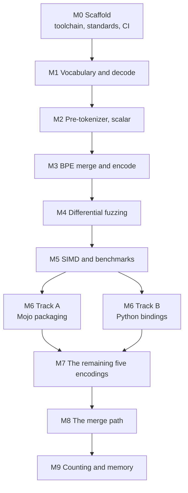

<!--
  SPDX-License-Identifier: EUPL-1.2
  Copyright 2026 Olaf Yunus Laitinen Imanov
  Part of the Knap project. See LICENSE for terms.
-->

# Knap Roadmap

  <picture>
    <source media="(prefers-color-scheme: dark)"
            srcset="assets/knap_logo_transparent_white.svg">
    
  </picture>

| Field | Value |
| --- | --- |
| Document | `docs/ROADMAP.md` |
| Project | Knap, a pure Mojo byte level BPE tokenizer |
| Version | 1.0.0 |
| Status | Draft |
| Applies to | Knap 1.0.0, Mojo 1.0.0 |
| Author | Olaf Yunus Laitinen Imanov |
| ORCID | [0009-0006-5184-0810](https://orcid.org/0009-0006-5184-0810) |
| Affiliation | School of Information and Communication Technology, Metropolia University of Applied Sciences |
| Created | 2026-09-07 |
| Updated | 2026-09-07 |
| Licence | EUPL-1.2 |
| Website | <https://knap.lovable.app> |

---

## Contents

1. [Milestone gates](#milestone-gates)
2. [Current position](#current-position)
3. [Files not yet written](#files-not-yet-written)
4. [Deferred beyond version 1](#deferred-beyond-version-1)
5. [Toolchain constraints](#toolchain-constraints)
6. [Release and archiving](#release-and-archiving)

---

## Milestone gates

A gate is not passed until its condition has actually been run and observed.
Reasoning that the code looks right does not pass a gate.

Two orderings are binding and cannot be traded away:

- **Scalar before SIMD.** The scalar scanner must be correct and its golden
  test passing before any SIMD classifier is written. The scalar path is not
  scaffolding to be discarded. It stays forever as the reference that the SIMD
  path is differentially tested against.
- **Parity before optimization.** M4 must be green before any M5 work lands.
  Optimising against an unverified baseline produces fast wrong answers.

M6 splits into two independent tracks because one may succeed while the other
does not. Track A should succeed. Track B depends on a capability that has not
been verified to exist.

M7 comes last on purpose. Adding encodings before the verification machinery
existed would have meant adding them on trust; adding them afterwards meant
every one arrived through the same gates the first two did, and the two
defects it found were found by those gates rather than by a user.

## Current position

**M0 through M9 are complete.** Every condition below was observed, not
inferred.

M9 added a counting entry point and a memory measurement. Both were expected
to be small and neither turned out the way it was expected to: the counting
path saves no time and a great deal of memory, and the memory measurement
found that Knap holds a vocabulary in a fraction of what the reference
implementation needs, which nobody had measured because nobody measures
memory.

| M9 condition | Evidence |
| --- | --- |
| Counting never builds the list of ids | A compile time parameter through the merge loop and the segment encoder, so one implementation serves both paths. Two merge loops that had to agree would be a correctness hazard, not an optimisation. |
| Counting agrees with encoding | `tests/test_count.mojo`, six tests, every one comparing a count against the length of the encode of the same input rather than against a number written by hand. Asserted again over the whole 110 MB corpus, for each of the four distinct encode behaviours. |
| The expectation was recorded when it was refuted | Counting was written expecting to be faster. It is not, and [docs/BENCHMARKS.md](BENCHMARKS.md) says so next to the numbers. |
| Memory is measured, with a control | `bench/memory.py` and `bench/mem_probe.mojo`, one child process per stage so that a high water mark belongs to one thing, and an empty runtime reported every time. |
| The helpers a caller would otherwise write | Windowing with overlap, truncation, a budget check, batch encoding, and token lookup. `tests/test_windows.mojo`, nine tests, built on the property that a window cut on a pre-token boundary encodes to exactly the slice of the whole document's encoding that covers it. |
| Padding and attention masks, with the padding id required | `pad_ordinary_batch` produces a row major rectangle, a mask, and each row's real length. There is no default padding id and there cannot be one: no encoding here defines a padding token, so any value is the caller's decision about their own model. `tests/test_padding.mojo`, six tests, each comparing every position against the encoder. One of them pads with the id of a real token so that the ids alone cannot separate content from padding, which is the case the mask exists for and the only one that can tell a working mask from a decorative one. |
| Truncation by token and truncation by pre-token are different operations, and both are needed | A window must re-encode to itself, so it cuts on a pre-token boundary. A fixed width model input needs exactly that many columns, so padding cuts by token and will cut inside a word. Both rules are implemented, and `examples/chunker.mojo` puts them next to each other so the difference is visible rather than surprising. |
| Two examples that are executed, not illustrated | `examples/budget.mojo` and `examples/chunker.mojo`, run in CI against real repository files. Every figure quoted in `examples/README.md` is output that was observed. |
| Two claims about the vocabularies became repeatable | `scripts/diff_vocabs.py` reproduces both: `gpt2` and `r50k_base` are identical token for token and rank for rank, and `p50k_base` adds exactly 24 tokens, every one a run of 2 to 25 spaces with no length missing. |
| The reference itself is gated | `scripts/check_reference.py` checks every fetched vocabulary against the digest recorded when it was fetched, and the reference version against what the documents quote. |
| The memory measurement was checked before it was published | The first version reported 290 MB and would have claimed Knap uses six times what the reference does. The 290 MB was the benchmark harness reading the corpus. The control and the per stage split are what caught it. |

M8 made encode between 1.39 and 1.85 times faster with byte identical
output, which took Knap past `tiktoken` on three of the four distinct encode
behaviours and level with it on the fourth. It is the milestone the
project's own rules made possible: parity was established first, so every
change had a gate that could refuse it.

| M8 condition | Evidence |
| --- | --- |
| The cost was measured before anything was changed | Pre-tokenization takes 184 ms of a 987 ms encode of 4 MB, so four fifths of the time was in the merge path. Optimising the other fifth would have been optimising the wrong thing. |
| Every change passed the parity gate | 191762320 tokens over 110 MB, byte identical, after each of the four changes rather than once at the end. |
| The speedup is a paired measurement | The binary from before and the binary from after, run alternately five times in one session, medians compared. This machine's absolute figures drift between sessions by more than the effect. |
| The baselines were re-run in the same session | `tiktoken`, `rs-bpe` and Hugging Face `tokenizers` all measured in `bench/results/run-20260909T155954Z.txt`, not quoted from an earlier run. |
| A change that could not be shown to pay was labelled as such | The third of the four measured faster on three encodings and slower on one, and the machine could not resolve it. It is kept and the ambiguity is written down rather than rounded away. |
| A result that moved under the change was republished, not hidden | The piece cache is now slower than the uncached path on `cl100k_base`, because the work it saves became cheap. Both numbers are in [docs/BENCHMARKS.md](BENCHMARKS.md). |

M7 added the five remaining `tiktoken` encodings, taking the total from two
to all seven. Its real content is that adding them found two defects in code
that had been passing every gate for two encodings, and that both defects
were in the assumptions rather than in the algorithms.

| M7 condition | Evidence |
| --- | --- |
| All seven encodings load | Four vocabulary files serve seven names. `o200k_harmony` shares `o200k_base`'s table, `p50k_edit` shares `p50k_base`'s, and `gpt2` loads from `r50k_base.tiktoken` because their merge ranks are byte identical, which was checked entry by entry rather than assumed. |
| The third pattern | `scan_gpt2` in `src/knap/pretokenize/scanner.mojo`, matching the reference over 28699602 piece boundaries across 110 MB. |
| Encode parity | 191762320 tokens over 110 MB across the four distinct behaviours, plus a separate `tiktoken` fixture comparison for each of the seven names. |
| Decode parity | All 702463 ids in all seven encodings, with the number of undecodable ids asserted exactly rather than loosely. |
| The grouping is asserted, not assumed | `tests/test_encode.mojo` shows the encodings that share a table agreeing and the ones that do not differing, on an input chosen to separate every group. |
| Reached through every entry point | The command line tool, the Python bindings, and the fuzzer all take all seven. The fuzzer's committed report still covers two, because that is the run that has been observed; the nightly job runs seven. |
| Defect: a special token on a reserved merge rank | `p50k_base` puts its end of text marker at 50256, inside its merge range rather than above it. Decode tested the range instead of asking whether the rank was assigned, found the hole, and refused to decode the one special token that encoding has. Found by the decode gate on the day the encoding was added. |
| Defect: a loose assertion that checked nothing | The decode gate required a golden fixture to hold at least one undecodable id. True of both encodings shipped at the time, false of four of the seven, so it would have passed while checking nothing on them. It now asserts the exact count. |

M6 delivered both tracks. Track A packages the library for conda, Track B
exports it to Python as a native extension. Track B was the one the plan
listed as depending on a capability that had not been verified to exist. It
exists.

| M6 condition | Evidence |
| --- | --- |
| Track A, package builds | `conda.recipe/recipe.yaml`, built by rattler-build to `knap-0.1.0-hb0f4dca_0.conda`, 174.56 KiB. That artefact was built before the version was declared 1.0.0, and the name is left as it was rather than edited to match, because it records what was actually produced. The recipe moved to the conventional path and was rewritten to build from a git revision during packaging preparation; see [docs/PACKAGING.md](PACKAGING.md). |
| Track A, package imports without the source tree | The recipe's own test compiles and runs a program against the installed artefact only. Mirrored as a CI job. |
| Track A, compiler pinned | `mojo-compiler ==1.0.0` in both build and run requirements. A consumer on another toolchain gets a solver error rather than a link error. |
| Track B, native extension | `PythonModuleBuilder` builds a real CPython extension. The `ctypes` fallback was never needed and the flat C surface it would have required was never added. |
| Track B, parity through the bindings | `bindings/python/tests/test_bindings.py` checks the bindings against tiktoken directly, rather than trusting the Mojo tests. |
| Track B, ABI honesty | No wheel is published and the built library is not committed, because the Mojo ABI is not stable and a wheel is a promise that a binary keeps working. |

M5 delivered the vectorised classifier, the piece cache, and the benchmark
suite. Its real content is that two of the three produced qualified rather
than triumphant results, and that fixing the benchmark corpus invalidated
every performance claim the project had made up to that point.

| M5 condition | Evidence |
| --- | --- |
| Vectorised classifier written and correct | `src/knap/pretokenize/classifier_simd.mojo`, differentially tested against the scalar one in `tests/test_classifier_parity.mojo`. |
| Vectorised classifier measured | **Indistinguishable from the scalar path on this machine.** Off by default, kept behind `-D KNAP_SIMD=1`, because an unmeasurable gain does not justify a second implementation. Numbers in [docs/BENCHMARKS.md](BENCHMARKS.md). |
| Piece cache written and correct | `src/knap/cache.mojo`, held to the tiktoken reference rather than to the uncached path, in `tests/test_cache.mojo`. |
| Piece cache measured | Numbers in [docs/BENCHMARKS.md](BENCHMARKS.md), cold and warm, with the memory it holds. |
| Benchmarks against three baselines | `bench/baselines/`, all reading the same corpus slice by the same rule, checked for agreement before any run. |
| Benchmark methodology | The suite records the machine, the versions, the effective build target, and the coefficient of variation of every measurement. |

M4 delivered the differential fuzzer. It is the milestone that found the one
real divergence class this project has had.

| M4 condition | Evidence |
| --- | --- |
| Ten million inputs per encoding | 20000000 generated, 16661834 compared against the reference, 3338166 round trip checked, 0 divergences. |
| Reproducible | Every shard seed is written to `tests/fuzz/last_run.json`. |
| One hundred thousand under the address sanitizer | 200000 generated, 0 divergences, reported in `tests/fuzz/last_run.address.json`. |
| Knap proved not to leak | `tests/fuzz/asan_solo.mojo` drives the same generators with no interpreter in the process, and passes with no suppression file. |
| A divergence found and fixed | The Unicode version mismatch, after 19288 inputs. Three inputs from the hunt are kept as regression seeds. |

M3 delivered the merge rank table, the merge loop, and the public tokenizer
API with both encode entry points. Its gate, matching `tiktoken.encode`
across the corpus, passes for both encodings over 80.5 million tokens, and
was extended at M7 to four encodings over 191.8 million.

| M3 condition | Evidence |
| --- | --- |
| Merge loop | `src/knap/bpe.mojo`, with unit tests over a synthetic vocabulary small enough to check by hand. |
| Rank table | `src/knap/ranks.mojo`, which refuses a vocabulary missing any of the 256 single byte tokens. |
| `encode_ordinary` | 43529983 and 36927147 tokens identical to the reference over 110 MB. |
| `encode` with special sets | Allowed markers emit their id, disallowed markers raise. Measured against the reference. |
| Hazards | One test per entry in `docs/CORRECTNESS.md`, with expected tokens measured rather than recalled. |
| Round tripping | Every byte value, every fixture, and deliberately malformed sequences. |

The M2 conditions, for the record:

M2 delivered the generated pattern constants, the Unicode tables, the UTF-8
decoder, the scalar classifier, and the two scanners. Its gate, matching the
reference regex over at least 100 MB of mixed text, passes for both patterns
across 54.3 million pieces.

| M2 condition | Evidence |
| --- | --- |
| Pattern extracted, not transcribed | `scripts/extract_patterns.py`, with the committed constant checked for drift. |
| Unicode tables generated | Unicode 16.0.0, 2391 runs, verified against all 1114112 code points. Generated from 15.0.0 at first, which milestone M4 proved wrong. See [docs/UNICODE.md](UNICODE.md). |
| Scalar scanner correct | 28075654 and 26250703 piece boundaries identical to the reference over 110 MB. |
| Both representations measured | Sorted runs against a two stage table, written up in `docs/UNICODE.md`. |
| Suite under ASan | Passes, including the scanner over the full corpus. |

The M1 conditions, for the record:

M1 delivered vocabulary loading, the flat token store, decode over the full
id space, and the special token registry. Its gate, decoding every token id
in both vocabularies byte identically against `tiktoken`, passes for all
300296 ids. See [docs/CORRECTNESS.md](CORRECTNESS.md).

| M1 condition | Evidence |
| --- | --- |
| `.tiktoken` loader | `src/knap/vocab.mojo`, strict on every malformed shape, 7 rejection tests. |
| FlatVocab | `src/knap/flat_vocab.mojo`, spans validated once at construction. |
| Decode | Byte exact over both encodings, including the gaps, which raise. Extended to all seven at M7. |
| Special token registry | `src/knap/special.mojo`, ids cross checked by decoding each to its own literal text. |
| EmberJson evaluated | Passed both acceptance criteria. Decision recorded in `docs/ARCHITECTURE.md`. |
| Suite under ASan | All 26 tests pass with `--sanitize address`. |

The M0 conditions, for the record:

| M0 condition | Evidence |
| --- | --- |
| Agent skills installed | Four Mojo skills installed from the Modular repository. |
| Mojo VS Code extension installed | Version 26.6.1. |
| Toolchain pinned and working | Mojo 1.0.0 build `ed45d567`, installed by uv and independently by pixi. |
| A Mojo file compiles and runs | `tests/test_toolchain.mojo`, four tests, all passing. |
| Test runner wired up | Standard library `TestSuite`, since `mojo test` does not exist in 1.0.0. |
| Standards scripts written and passing | Four scripts, each demonstrated to fail on a planted violation. |
| Unstable API inventory captured | 108 uses across 22 APIs, recorded in `docs/ARCHITECTURE.md`. |
| Sanitizer job proven | `--sanitize address` builds and runs the suite clean. |

## Files not yet written

The repository brief asked for the complete directory tree to be created up
front with stub files, and separately forbade placeholders in committed files.
Those two instructions conflict, and the conflict is resolved here in favour
of the no-placeholder rule, which is listed as a hard constraint.

Every directory in the layout exists. Files that cannot yet be complete are
absent rather than stubbed, and are listed below with the milestone that
creates them. A stub that compiles but does nothing would pass every gate in
this repository while providing nothing, which is precisely the failure mode
the no-placeholder rule exists to prevent.

Everything on that list has since been written, except one file, which is
now a decision rather than a delay:

| Path | Status |
| --- | --- |
| `src/knap/cache.mojo`, `config.mojo` | Written at M5. |
| `src/knap/pretokenize/classifier_simd.mojo` | Written at M5, and measured slower. Kept behind a flag. |
| `tests/test_*.mojo` | Written alongside the code each one tests. |
| `tests/fuzz/*` | Written at M4. |
| `bench/*` | Written at M5. |
| `bindings/python/*` | Written at M6 Track B. |
| `docs/BENCHMARKS.md` | Written at M5, from a real run on a described machine. |
| `.github/workflows/bench.yml` | Written at M5, as a smoke run. It asserts the suite still runs and states plainly that its numbers are not publishable, because a shared runner cannot produce a comparable one. |
| `src/knap/hf/tokenizer_json.mojo` | **Not written. Moved to the deferred list below.** |

The Hugging Face loader is the one file from the original layout that does
not exist, and the reason is worth stating rather than leaving as an empty
row. Loading a `tokenizer.json` is not a file format exercise. That format
carries its own pre-tokenizer specification, its own added token rules, and
vocabularies built by a different pipeline, so a loader for it needs its own
parity corpus and its own reference implementation before any of its output
can be trusted. Shipping one without that would put an unverified path
inside a library whose entire claim is verification. It is a project of the
same size as milestones M2 and M3 together, and it is listed below with the
other work that is deferred by decision.

Some paths exist that the original layout did not list. Every one is an
addition rather than a substitution, and none creates a parallel directory:

| Path | Why it exists |
| --- | --- |
| `tests/test_toolchain.mojo` | The layout had no slot for the toolchain smoke test that M0 requires. It deliberately imports nothing from `src/knap`, so a failure there always means the compiler rather than Knap. |
| `docs/API.md` | A generated reference for the public surface. `mojo doc` emits JSON and not HTML, and its own help says the format is subject to change, so a documentation site would be a renderer built on a foundation the tool declares unstable. Markdown in the repository is the better artefact anyway: it renders on the forge with nothing to deploy, and a change to the public interface shows up in a pull request diff, which for a version claiming a settled interface is worth more than a browsable page. |
| `cli/` | The command line tool, added after milestone M6. It is an application rather than part of the library, so it sits outside `src/knap` and the library has no dependency on it. `cli/args.mojo` holds everything pure, which is what lets `tests/test_cli.mojo` check the parser without a vocabulary; `cli/tests/test_end_to_end.py` runs the built binary against the reference, because a parser test cannot tell you whether the numbers are right. |
| `scripts/selftest_gates.py` | M0 requires each standards gate to be observed failing on a planted violation. Doing that once by hand proves it once. This makes it repeatable and runs it in CI, so a gate that silently stops working is caught. |
| `examples/` | Two complete programs, for the two problems callers of every tokenizer solve wrongly: a token budget check and a chunker. Both run in CI against real repository files, because an example nothing executes rots at the first signature change and the first person to find out is a reader. |
| `docs/TOOLCHAIN.md` | The compilation of Mojo 1.0.0 findings, moved out of `docs/ARCHITECTURE.md` when it grew past what a design document should carry. It is useful to somebody who never uses Knap, which is the argument for it being its own document. `scripts/check_toolchain_doc.py` resolves every file it cites. |
| `docs/METHODOLOGY.md` | How the numbers were measured and the correctness claims established, written to be reused on a project that is not this one. The benchmark and correctness documents state results; this one states the method, which is the part that is transferable. |
| `sbom.cdx.json` | A CycloneDX 1.6 bill of materials generated from the lock file by `scripts/gen_sbom.py` and gated for drift alongside the other generated files. It exists to answer one question quickly: when an advisory lands, does it reach a consumer through Knap. |
| `cli/completions/` | Completions for bash, zsh and fish, installed by the conda package. `cli/tests/test_completions.py` reads the command, option and encoding lists out of the parser and checks all three files offer them. |

That last paragraph used to say that `docs/BENCHMARKS.md` was deliberately
absent rather than present and empty, because a benchmarks document with no
benchmarks in it invites exactly the kind of unsupported claim this project
is trying to avoid. It was written at M0 and it held until M5, when the
document arrived with a real run behind it. The rule it states still holds
and is worth keeping in view: nothing goes in that document that was not
run and observed on a described machine.

## Deferred beyond version 1

Each of these is a decision, not an oversight.

| Item | Why deferred |
| --- | --- |
| Offset mapping, a byte range per token | Windows already carry byte ranges, which covers chunking. Per token spans double the correctness surface: every parity test would need a second dimension. The information is not expensive to produce, because the merge loop already computes the boundaries and discards them, so this is deferred on the size of its test surface rather than on the cost of the code. |
| Streaming encode | A pre-token boundary can only be known to be final by looking at what follows it, so a streaming encoder has to prove a boundary is settled before emitting it. That proof is the whole feature and it is not a small one. |
| BPE training | Knap encodes. Training is a different program with a different correctness story and no shared hot path. |
| Offset mapping, character spans per token | Genuinely valuable, and it doubles the correctness surface. Every parity test would need a second dimension. Revisit once encode parity is established and stable. |
| WordPiece, Unigram, SentencePiece | Different algorithms, not variations on this one. Each would need its own parity corpus and its own reference implementation. |
| Normalization pipelines, NFC and NFKC | None of the seven encodings normalize. Adding a normalizer that is not needed can only introduce divergence. |
| Chat templates | A serving concern layered above tokenization, not part of it. |
| GPU tokenization | The merge loop does not vectorize on a CPU and will not on a GPU. The pre-tokenizer might, but the transfer cost would dominate at realistic input sizes. |
| Hugging Face `tokenizer.json` loading | Deferred from the original layout, where it was listed as experimental. The format specifies its own pre-tokenizer rather than reusing either pattern Knap implements, so it needs a second parity corpus and a second reference implementation, which is the work of two milestones rather than one file. The dependency evaluated for it, EmberJson, passed its acceptance criteria and the finding is kept in [docs/ARCHITECTURE.md](ARCHITECTURE.md) for whoever picks this up. |
| Parallel batch encoding | Not deferred by choice. Mojo 1.0.0 has no working task parallelism, so there is nothing to build it on. See [docs/ARCHITECTURE.md](ARCHITECTURE.md). |
| Single document parallelism | A pattern match may span a chunk boundary, so independent chunks can produce different tokens. Reproducing the boundary adjustment logic correctly is a project of its own. See `docs/ARCHITECTURE.md`. |
| Additional vocabularies beyond the two targeted | Each additional vocabulary multiplies the fuzzing and golden fixture cost. Add them only when the parity methodology has proven itself on two. |

## Toolchain constraints

These are limits of the current toolchain rather than choices, and each one
should be revisited when the toolchain moves.

| Constraint | Consequence |
| --- | --- |
| Mojo publishes no Windows wheel | Windows development requires WSL. There is no native Windows build and the README says so. |
| The Mojo ABI is not stable | Any Python binding is version locked to the exact toolchain and must be rebuilt per release. |
| Almost the entire standard library is unstable | The unstable API inventory is a record of exposure, not an action list. See `docs/ARCHITECTURE.md`. |
| `--Werror` and `--warn-on-unstable-apis` cannot be combined | CI runs them as separate jobs, one gating and one reporting. |
| `mojo format` has no check mode | CI formats in place and then verifies the working tree is unchanged. |
| No native Mojo package manager | Libraries are distributed as conda packages. Release targets the `modular-community` channel. |
| Whether Mojo can export an importable Python extension module is unverified | M6 Track B is designed around a flat C compatible surface so the `--emit shared-lib` fallback stays open regardless of the answer. Resolved: it can. |
| Mojo 1.0.0 has no working task parallelism | Batch encoding is single threaded. Confirmed against the upstream roadmap below rather than only against this machine. |

### What the upstream roadmap says about these

The constraints above were each found by compiling against the pinned
toolchain. Reading Modular's own published roadmap afterwards is worth the
five minutes, because it separates a limit that is acknowledged and planned
from one that might be a local mistake. Every row below is quoted from the
roadmap for Mojo 1.0.0 at <https://mojolang.org/docs/roadmap/>, read on
2026-09-09.

| Knap's finding | Upstream status |
| --- | --- |
| No working task parallelism, so batch encoding is single threaded | Phase 2 lists first class `async` support as not started. The limitation is acknowledged and scheduled, not an error in how Knap invoked it. |
| `mojo test` does not exist, so a test file is a program driving `TestSuite` | Phase 2 lists the testing framework as in progress. |
| The benchmark harness is written by hand, including the statistics | Phase 2 lists the benchmarking framework as in progress. |
| No native package manager, so distribution is a conda package | Phase 2 lists packaging and package management as not started. |
| `@value` is gone and `comptime if` replaces `@parameter if` | Phase 1 lists attribute macros as in progress, replacing ad hoc constructs such as `@parameter` and `@value` with traits. |
| Almost the whole standard library is unstable | Phase 1 lists stabilization markers as complete, which is what makes `--warn-on-unstable-apis` able to answer at all. |
| Nothing enforces module boundaries, so the underscore convention is all there is | Phase 2 lists access control features, including `private`, as not started. |

Two things follow. The single threaded batch path should be revisited when
`async` lands rather than reworked now, and the hand written test and
benchmark harnesses should be expected to be replaced rather than extended.
Neither changes anything today, and both are cheaper to know than to
rediscover.

## Release and archiving

Once there is a tagged release, archiving it through Zenodo would produce a
citable DOI, which pairs naturally with the ORCID already recorded in
`CITATION.cff`. This is very likely wanted, and it is not done unprompted
because it is the author's decision to make.

`CITATION.cff` version and release date are updated in the same commit as the
`CHANGELOG.md` entry for that release.

One release rule specific to this project: any change to tokenizer output is a
breaking change, even when the public API is untouched. Consumers pin token
ids into caches, datasets, and evaluation results, so an output change breaks
them just as thoroughly as a signature change would.

---

## Document control

| Field | Value |
| --- | --- |
| Previous | [docs/STYLE.md](STYLE.md) |
| Next | [README.md](../README.md) |
| Index | [README.md](../README.md) |
| Revision | 1.0.0 |
| Last reviewed | 2026-09-07 |

Knap is licensed under the European Union Public Licence 1.2.
Copyright 2026 Olaf Yunus Laitinen Imanov, Metropolia University of Applied
Sciences. See [LICENSE](../LICENSE) for the full terms.

<!-- End of document: docs/ROADMAP.md -->
