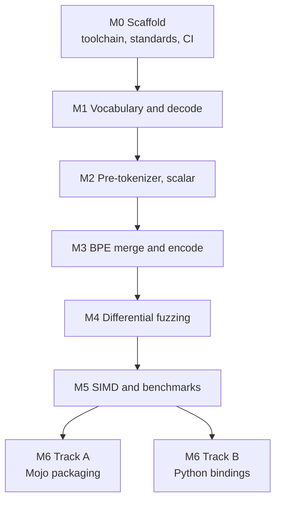

<!--
  SPDX-License-Identifier: EUPL-1.2
  Copyright 2026 Olaf Yunus Laitinen Imanov
  Part of the Knap project. See LICENSE for terms.
-->

# Knap Roadmap

  <picture>
    <source media="(prefers-color-scheme: dark)"
            srcset="assets/knap_logo_transparent_white.svg">
    
  </picture>

| Field | Value |
| --- | --- |
| Document | `docs/ROADMAP.md` |
| Project | Knap, a pure Mojo byte level BPE tokenizer |
| Version | 1.0.0 |
| Status | Draft |
| Applies to | Knap 0.1.0, Mojo 1.0.0 |
| Author | Olaf Yunus Laitinen Imanov |
| ORCID | [0009-0006-5184-0810](https://orcid.org/0009-0006-5184-0810) |
| Affiliation | School of Information and Communication Technology, Metropolia University of Applied Sciences |
| Created | 2026-09-07 |
| Updated | 2026-09-07 |
| Licence | EUPL-1.2 |

---

## Contents

1. [Milestone gates](#milestone-gates)
2. [Current position](#current-position)
3. [Files not yet written](#files-not-yet-written)
4. [Deferred beyond version 1](#deferred-beyond-version-1)
5. [Toolchain constraints](#toolchain-constraints)
6. [Release and archiving](#release-and-archiving)

---

## Milestone gates

A gate is not passed until its condition has actually been run and observed.
Reasoning that the code looks right does not pass a gate.

Two orderings are binding and cannot be traded away:

- **Scalar before SIMD.** The scalar scanner must be correct and its golden
  test passing before any SIMD classifier is written. The scalar path is not
  scaffolding to be discarded. It stays forever as the reference that the SIMD
  path is differentially tested against.
- **Parity before optimization.** M4 must be green before any M5 work lands.
  Optimising against an unverified baseline produces fast wrong answers.

M6 splits into two independent tracks because one may succeed while the other
does not. Track A should succeed. Track B depends on a capability that has not
been verified to exist.

## Current position

**M0 through M6 are complete.** Every condition below was observed, not
inferred.

M6 delivered both tracks. Track A packages the library for conda, Track B
exports it to Python as a native extension. Track B was the one the plan
listed as depending on a capability that had not been verified to exist. It
exists.

| M6 condition | Evidence |
| --- | --- |
| Track A, package builds | `recipe/recipe.yaml`, built by rattler-build to `knap-0.1.0-hb0f4dca_0.conda`, 174.56 KiB. |
| Track A, package imports without the source tree | The recipe's own test compiles and runs a program against the installed artefact only. Mirrored as a CI job. |
| Track A, compiler pinned | `mojo-compiler ==1.0.0` in both build and run requirements. A consumer on another toolchain gets a solver error rather than a link error. |
| Track B, native extension | `PythonModuleBuilder` builds a real CPython extension. The `ctypes` fallback was never needed and the flat C surface it would have required was never added. |
| Track B, parity through the bindings | `bindings/python/tests/test_bindings.py` checks the bindings against tiktoken directly, rather than trusting the Mojo tests. |
| Track B, ABI honesty | No wheel is published and the built library is not committed, because the Mojo ABI is not stable and a wheel is a promise that a binary keeps working. |

M5 delivered the vectorised classifier, the piece cache, and the benchmark
suite. Its real content is that two of the three produced qualified rather
than triumphant results, and that fixing the benchmark corpus invalidated
every performance claim the project had made up to that point.

| M5 condition | Evidence |
| --- | --- |
| Vectorised classifier written and correct | `src/knap/pretokenize/classifier_simd.mojo`, differentially tested against the scalar one in `tests/test_classifier_parity.mojo`. |
| Vectorised classifier measured | **Indistinguishable from the scalar path on this machine.** Off by default, kept behind `-D KNAP_SIMD=1`, because an unmeasurable gain does not justify a second implementation. Numbers in [docs/BENCHMARKS.md](BENCHMARKS.md). |
| Piece cache written and correct | `src/knap/cache.mojo`, held to the tiktoken reference rather than to the uncached path, in `tests/test_cache.mojo`. |
| Piece cache measured | Numbers in [docs/BENCHMARKS.md](BENCHMARKS.md), cold and warm, with the memory it holds. |
| Benchmarks against three baselines | `bench/baselines/`, all reading the same corpus slice by the same rule, checked for agreement before any run. |
| Benchmark methodology | The suite records the machine, the versions, the effective build target, and the coefficient of variation of every measurement. |

M4 delivered the differential fuzzer. It is the milestone that found the one
real divergence class this project has had.

| M4 condition | Evidence |
| --- | --- |
| Ten million inputs per encoding | 20000000 generated, 16661834 compared against the reference, 3338166 round trip checked, 0 divergences. |
| Reproducible | Every shard seed is written to `tests/fuzz/last_run.json`. |
| One hundred thousand under the address sanitizer | 200000 generated, 0 divergences, reported in `tests/fuzz/last_run.address.json`. |
| Knap proved not to leak | `tests/fuzz/asan_solo.mojo` drives the same generators with no interpreter in the process, and passes with no suppression file. |
| A divergence found and fixed | The Unicode version mismatch, after 19288 inputs. Three inputs from the hunt are kept as regression seeds. |

M3 delivered the merge rank table, the merge loop, and the public tokenizer
API with both encode entry points. Its gate, matching `tiktoken.encode`
across the corpus, passes for both encodings over 80.5 million tokens.

| M3 condition | Evidence |
| --- | --- |
| Merge loop | `src/knap/bpe.mojo`, with unit tests over a synthetic vocabulary small enough to check by hand. |
| Rank table | `src/knap/ranks.mojo`, which refuses a vocabulary missing any of the 256 single byte tokens. |
| `encode_ordinary` | 43529983 and 36927147 tokens identical to the reference over 110 MB. |
| `encode` with special sets | Allowed markers emit their id, disallowed markers raise. Measured against the reference. |
| Hazards | One test per entry in `docs/CORRECTNESS.md`, with expected tokens measured rather than recalled. |
| Round tripping | Every byte value, every fixture, and deliberately malformed sequences. |

The M2 conditions, for the record:

M2 delivered the generated pattern constants, the Unicode tables, the UTF-8
decoder, the scalar classifier, and the two scanners. Its gate, matching the
reference regex over at least 100 MB of mixed text, passes for both patterns
across 54.3 million pieces.

| M2 condition | Evidence |
| --- | --- |
| Pattern extracted, not transcribed | `scripts/extract_patterns.py`, with the committed constant checked for drift. |
| Unicode tables generated | Unicode 16.0.0, 2391 runs, verified against all 1114112 code points. Generated from 15.0.0 at first, which milestone M4 proved wrong. See [docs/UNICODE.md](UNICODE.md). |
| Scalar scanner correct | 28075654 and 26250703 piece boundaries identical to the reference over 110 MB. |
| Both representations measured | Sorted runs against a two stage table, written up in `docs/UNICODE.md`. |
| Suite under ASan | Passes, including the scanner over the full corpus. |

The M1 conditions, for the record:

M1 delivered vocabulary loading, the flat token store, decode over the full
id space, and the special token registry. Its gate, decoding every token id
in both vocabularies byte identically against `tiktoken`, passes for all
300296 ids. See [docs/CORRECTNESS.md](CORRECTNESS.md).

| M1 condition | Evidence |
| --- | --- |
| `.tiktoken` loader | `src/knap/vocab.mojo`, strict on every malformed shape, 7 rejection tests. |
| FlatVocab | `src/knap/flat_vocab.mojo`, spans validated once at construction. |
| Decode | Byte exact over both encodings, including the gaps, which raise. |
| Special token registry | `src/knap/special.mojo`, ids cross checked by decoding each to its own literal text. |
| EmberJson evaluated | Passed both acceptance criteria. Decision recorded in `docs/ARCHITECTURE.md`. |
| Suite under ASan | All 26 tests pass with `--sanitize address`. |

The M0 conditions, for the record:

| M0 condition | Evidence |
| --- | --- |
| Agent skills installed | Four Mojo skills installed from the Modular repository. |
| Mojo VS Code extension installed | Version 26.6.1. |
| Toolchain pinned and working | Mojo 1.0.0 build `ed45d567`, installed by uv and independently by pixi. |
| A Mojo file compiles and runs | `tests/test_toolchain.mojo`, four tests, all passing. |
| Test runner wired up | Standard library `TestSuite`, since `mojo test` does not exist in 1.0.0. |
| Standards scripts written and passing | Four scripts, each demonstrated to fail on a planted violation. |
| Unstable API inventory captured | 108 uses across 22 APIs, recorded in `docs/ARCHITECTURE.md`. |
| Sanitizer job proven | `--sanitize address` builds and runs the suite clean. |

## Files not yet written

The repository brief asked for the complete directory tree to be created up
front with stub files, and separately forbade placeholders in committed files.
Those two instructions conflict, and the conflict is resolved here in favour
of the no-placeholder rule, which is listed as a hard constraint.

Every directory in the layout exists. Files that cannot yet be complete are
absent rather than stubbed, and are listed below with the milestone that
creates them. A stub that compiles but does nothing would pass every gate in
this repository while providing nothing, which is precisely the failure mode
the no-placeholder rule exists to prevent.

Everything on that list has since been written, except one file, which is
now a decision rather than a delay:

| Path | Status |
| --- | --- |
| `src/knap/cache.mojo`, `config.mojo` | Written at M5. |
| `src/knap/pretokenize/classifier_simd.mojo` | Written at M5, and measured slower. Kept behind a flag. |
| `tests/test_*.mojo` | Written alongside the code each one tests. |
| `tests/fuzz/*` | Written at M4. |
| `bench/*` | Written at M5. |
| `bindings/python/*` | Written at M6 Track B. |
| `docs/BENCHMARKS.md` | Written at M5, from a real run on a described machine. |
| `.github/workflows/bench.yml` | Written at M5, as a smoke run. It asserts the suite still runs and states plainly that its numbers are not publishable, because a shared runner cannot produce a comparable one. |
| `src/knap/hf/tokenizer_json.mojo` | **Not written. Moved to the deferred list below.** |

The Hugging Face loader is the one file from the original layout that does
not exist, and the reason is worth stating rather than leaving as an empty
row. Loading a `tokenizer.json` is not a file format exercise. That format
carries its own pre-tokenizer specification, its own added token rules, and
vocabularies built by a different pipeline, so a loader for it needs its own
parity corpus and its own reference implementation before any of its output
can be trusted. Shipping one without that would put an unverified path
inside a library whose entire claim is verification. It is a project of the
same size as milestones M2 and M3 together, and it is listed below with the
other work that is deferred by decision.

Two files exist that the original layout did not list. Both are additions
rather than substitutions, and neither creates a parallel directory:

| Path | Why it exists |
| --- | --- |
| `tests/test_toolchain.mojo` | The layout had no slot for the toolchain smoke test that M0 requires. It deliberately imports nothing from `src/knap`, so a failure there always means the compiler rather than Knap. |
| `scripts/selftest_gates.py` | M0 requires each standards gate to be observed failing on a planted violation. Doing that once by hand proves it once. This makes it repeatable and runs it in CI, so a gate that silently stops working is caught. |

`docs/BENCHMARKS.md` is deliberately absent rather than present and empty. A
benchmarks document with no benchmarks in it invites exactly the kind of
unsupported claim this project is trying to avoid.

## Deferred beyond version 1

Each of these is a decision, not an oversight.

| Item | Why deferred |
| --- | --- |
| BPE training | Knap encodes. Training is a different program with a different correctness story and no shared hot path. |
| Offset mapping, character spans per token | Genuinely valuable, and it doubles the correctness surface. Every parity test would need a second dimension. Revisit once encode parity is established and stable. |
| WordPiece, Unigram, SentencePiece | Different algorithms, not variations on this one. Each would need its own parity corpus and its own reference implementation. |
| Normalization pipelines, NFC and NFKC | `cl100k_base` and `o200k_base` do not normalize. Adding a normalizer that is not needed can only introduce divergence. |
| Chat templates | A serving concern layered above tokenization, not part of it. |
| GPU tokenization | The merge loop does not vectorize on a CPU and will not on a GPU. The pre-tokenizer might, but the transfer cost would dominate at realistic input sizes. |
| Hugging Face `tokenizer.json` loading | Deferred from the original layout, where it was listed as experimental. The format specifies its own pre-tokenizer rather than reusing either pattern Knap implements, so it needs a second parity corpus and a second reference implementation, which is the work of two milestones rather than one file. The dependency evaluated for it, EmberJson, passed its acceptance criteria and the finding is kept in [docs/ARCHITECTURE.md](ARCHITECTURE.md) for whoever picks this up. |
| Parallel batch encoding | Not deferred by choice. Mojo 1.0.0 has no working task parallelism, so there is nothing to build it on. See [docs/ARCHITECTURE.md](ARCHITECTURE.md). |
| Single document parallelism | A pattern match may span a chunk boundary, so independent chunks can produce different tokens. Reproducing the boundary adjustment logic correctly is a project of its own. See `docs/ARCHITECTURE.md`. |
| Additional vocabularies beyond the two targeted | Each additional vocabulary multiplies the fuzzing and golden fixture cost. Add them only when the parity methodology has proven itself on two. |

## Toolchain constraints

These are limits of the current toolchain rather than choices, and each one
should be revisited when the toolchain moves.

| Constraint | Consequence |
| --- | --- |
| Mojo publishes no Windows wheel | Windows development requires WSL. There is no native Windows build and the README says so. |
| The Mojo ABI is not stable | Any Python binding is version locked to the exact toolchain and must be rebuilt per release. |
| Almost the entire standard library is unstable | The unstable API inventory is a record of exposure, not an action list. See `docs/ARCHITECTURE.md`. |
| `--Werror` and `--warn-on-unstable-apis` cannot be combined | CI runs them as separate jobs, one gating and one reporting. |
| `mojo format` has no check mode | CI formats in place and then verifies the working tree is unchanged. |
| No native Mojo package manager | Libraries are distributed as conda packages. Release targets the `modular-community` channel. |
| Whether Mojo can export an importable Python extension module is unverified | M6 Track B is designed around a flat C compatible surface so the `--emit shared-lib` fallback stays open regardless of the answer. |

## Release and archiving

Once there is a tagged release, archiving it through Zenodo would produce a
citable DOI, which pairs naturally with the ORCID already recorded in
`CITATION.cff`. This is very likely wanted, and it is not done unprompted
because it is the author's decision to make.

`CITATION.cff` version and release date are updated in the same commit as the
`CHANGELOG.md` entry for that release.

One release rule specific to this project: any change to tokenizer output is a
breaking change, even when the public API is untouched. Consumers pin token
ids into caches, datasets, and evaluation results, so an output change breaks
them just as thoroughly as a signature change would.

---

## Document control

| Field | Value |
| --- | --- |
| Previous | [docs/STYLE.md](STYLE.md) |
| Next | [README.md](../README.md) |
| Index | [README.md](../README.md) |
| Revision | 1.0.0 |
| Last reviewed | 2026-09-07 |

Knap is licensed under the European Union Public Licence 1.2.
Copyright 2026 Olaf Yunus Laitinen Imanov, Metropolia University of Applied
Sciences. See [LICENSE](../LICENSE) for the full terms.

<!-- End of document: docs/ROADMAP.md -->
