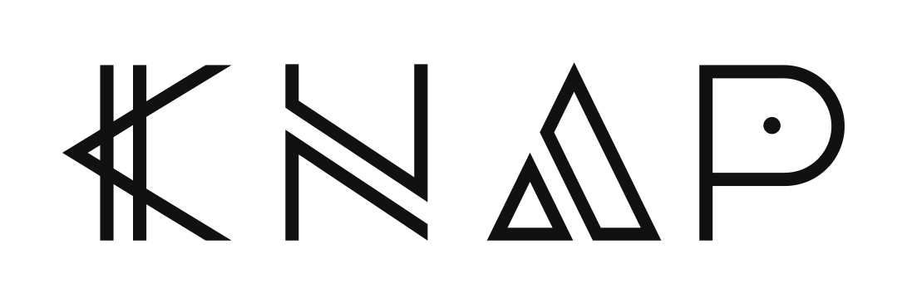

<!--
  SPDX-License-Identifier: EUPL-1.2
  Copyright 2026 Olaf Yunus Laitinen Imanov
  Part of the Knap project. See LICENSE for terms.
-->

# Knap Examples

<p align="center">
  <picture>
    <source media="(prefers-color-scheme: dark)"
            srcset="../docs/assets/knap_logo_transparent_white.svg">
    
  </picture>
</p>

| Field | Value |
| --- | --- |
| Document | `examples/README.md` |
| Project | Knap, a pure Mojo byte level BPE tokenizer |
| Version | 1.0.0 |
| Status | Draft |
| Applies to | Knap 1.0.0, Mojo 1.0.0 |
| Author | Olaf Yunus Laitinen Imanov |
| ORCID | [0009-0006-5184-0810](https://orcid.org/0009-0006-5184-0810) |
| Affiliation | School of Information and Communication Technology, Metropolia University of Applied Sciences |
| Created | 2026-09-10 |
| Updated | 2026-09-10 |
| Licence | EUPL-1.2 |
| Website | <https://knap.lovable.app> |

---

## Contents

1. [What is here](#what-is-here)
2. [Running them](#running-them)
3. [budget.mojo, and the question everyone asks first](#budgetmojo-and-the-question-everyone-asks-first)
4. [chunker.mojo, and the bug that does not raise](#chunkermojo-and-the-bug-that-does-not-raise)
5. [Why these two](#why-these-two)

---

## What is here

Two programs, each about a hundred lines, each solving a problem that a
tokenizer is bought for rather than a problem that shows off a tokenizer.

| File | What it does | Entry points it uses |
| --- | --- | --- |
| [`budget.mojo`](budget.mojo) | Reports which files fit in a context window, by how much the others overflow, and where to cut them. | `fits_ordinary_bytes`, `count_ordinary_bytes`, `truncate_ordinary_bytes` |
| [`chunker.mojo`](chunker.mojo) | Splits a document into overlapping windows and pads them into the rectangle a model takes. | `windows_ordinary_bytes`, `pad_ordinary_batch` |

Both use `cl100k_base` because it is the encoding most readers will
recognise. Any of the seven works, and the loader is the only line that
changes.

---

## Running them

Vocabularies are fetched rather than committed, so fetch them once:

```bash
uv run python scripts/fetch_vocabs.py
```

Then, from the repository root:

```bash
uv run mojo run -I src examples/budget.mojo 2048 LICENSE CODE_OF_CONDUCT.md
uv run mojo run -I src examples/chunker.mojo LICENSE 128 16
```

Both take their paths relative to the working directory, and both look for
the vocabulary under `tests/fixtures/vocabs/`, so run them from the root.

The outputs quoted below are from those two commands, on `LICENSE` and
`CODE_OF_CONDUCT.md`. Those two files were chosen because they do not
change, so the figures here stay true. Pointing the examples at a document
that is edited every week would make this page wrong within a week, which is
the same failure the examples themselves exist to demonstrate.

---

## budget.mojo, and the question everyone asks first

Does this fit. Every tokenizer gets asked it, and the obvious answer is
wasteful twice over.

The obvious answer encodes the document and takes the length of the list.
That allocates one machine integer per token in order to read a single
number off the end of it. On a large file that is hundreds of megabytes of
allocation thrown away on the next line. `count_ordinary_bytes` walks the
same scanner and the same merge loop through a compile time parameter and
never builds the list at all, which is worth 137.7 MB of peak memory on the
measurement recorded in [docs/BENCHMARKS.md](../docs/BENCHMARKS.md).

The obvious answer also counts all of a document when the first tenth of it
has already exceeded the budget. `fits_ordinary_bytes` stops at the token
that goes over and returns false, so checking a large file against a small
context window costs a fraction of a full count.

The example asks the cheap question first, and pays for the expensive one
only when the answer is no and the caller now needs a number:

```text
budget: 2048 tokens, encoding cl100k_base
LICENSE does not fit: 2919 tokens, over by 871 and fits up to byte 9968 of 13958
CODE_OF_CONDUCT.md fits: 1547 tokens, with 501 spare
```

`truncate_ordinary_bytes` returns a byte offset rather than a shortened
string, so the caller keeps the original buffer and decides for itself
whether to cut there, cut at the previous paragraph, or split the file in
two.

---

## chunker.mojo, and the bug that does not raise

Splitting a long document into model sized pieces is the work in front of
every retrieval pipeline, and the obvious implementation is quietly wrong.

The obvious one encodes the document, cuts the id list every N ids, and
decodes each piece back to text. Those cuts land inside tokens. A piece that
begins in the middle of a token decodes to mangled text, and re-encodes to a
different id sequence than the one it was cut from, so the index and the
model no longer agree about what was stored. Nothing raises. Every step
succeeds. The failure surfaces later as retrieval that is slightly worse
than it should be, and nobody attributes it to the chunker.

`windows_ordinary_bytes` cuts on pre-token boundaries and hands back byte
ranges rather than text. Two things follow from that choice:

- The original bytes are untouched, so a retrieval hit can point at the
  source document rather than at a copy of part of it.
- A window's encoding is exactly the slice of the whole document's encoding
  that covers it. That property is what `tests/test_windows.mojo` checks,
  nine tests, every one comparing against the encoder rather than against a
  number written by hand.

The second half of the example pads those windows into a rectangle, which is
what a model takes:

```text
13958 bytes into 26 windows of at most 128 tokens, overlapping by 16
  [0, 559) 128 tokens EUROPEAN UNION PUBLIC LICENCE v. 1.2  EUPL (c) th
  [460, 1092) 128 tokens  defined below) has placed the following  notice
  [1022, 1642) 128 tokens  Works':the works or software that could be cr
  ...
padded to 26 by 128 with 3318 real tokens and 10 padding
```

Two characters in those previews are transcribed rather than copied. The
licence text contains a copyright sign and a typographic apostrophe, and
every file in this repository is ASCII, so they appear above as `(c)` and a
plain quote. The counts and the byte offsets are exactly what the program
printed.

Padding is a different operation with the opposite rule, and this is where
the two sit next to each other so that the difference is visible.
`windows_ordinary_bytes` will not cut inside a pre-token, because a window
has to re-encode to itself. `pad_ordinary_batch` truncates by token and will
cut inside a word, because a fixed width input needs exactly that many
columns and nothing else will do.

`pad_ordinary_batch` requires the padding id and has no default. None of the
seven encodings defines a padding token, so any value is the caller's
decision about their own model, and choosing one silently would put an id
into a tensor that the model was never trained to see in that position. The
example reuses the end of text marker, which is what most people do, and
that is exactly the case where the attention mask stops being redundant:
once the padding id is also a real token, the ids alone cannot say which
columns are content, and the mask is the only record.

---

## Why these two

Neither example is a demonstration of encoding. `encode_ordinary` needs no
example, since it takes a string and returns a list.

They are here because the two problems above are where callers of every
tokenizer write the same wrong code, and because the entry points that make
them right are the part of this library with the least equivalent elsewhere.
Counting without allocating, a budget check that exits early, windows as
byte ranges with the re-encoding property, and a padded batch with a mask
are all described in [docs/API.md](../docs/API.md).

An example that only worked on the input it shipped with would be worth
nothing, so both run against real repository files, and every figure quoted
above is output observed on this repository rather than an illustration.

---

## Document control

| Field | Value |
| --- | --- |
| Previous | [docs/API.md](../docs/API.md) |
| Next | [docs/BENCHMARKS.md](../docs/BENCHMARKS.md) |
| Index | [README.md](../README.md) |
| Revision | 1.0.0 |
| Last reviewed | 2026-09-10 |

Knap is licensed under the European Union Public Licence 1.2.
Copyright 2026 Olaf Yunus Laitinen Imanov, Metropolia University of Applied
Sciences. See [LICENSE](../LICENSE) for the full terms.

<!-- End of document: examples/README.md -->
